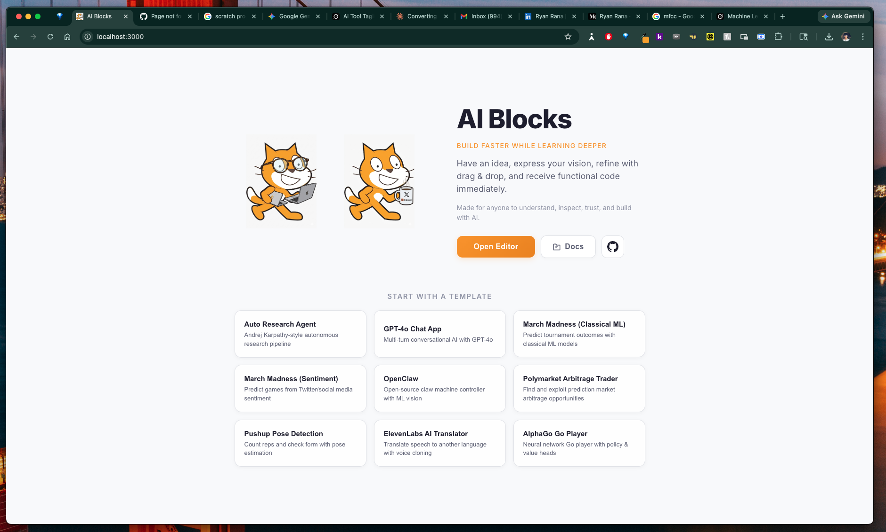
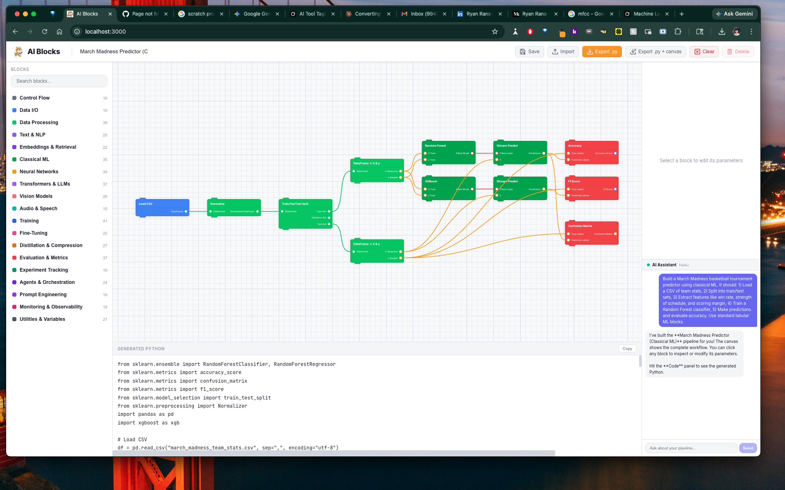
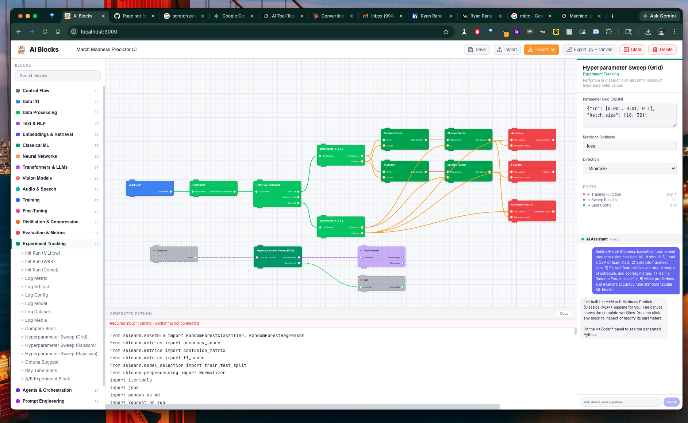
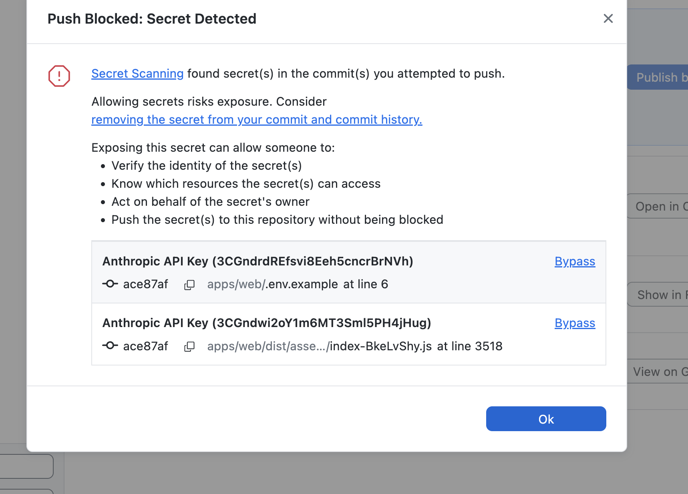

# AI Blocks

<p align="center">
  
  
</p>

**Scratch-like drag-and-drop visual programming for AI/ML engineering.**
Have an idea, refine with drag & drop, and receive functional code immediately.

*Built for anyone to understand, inspect, trust, and build with AI.*

---

## About the project

AI Blocks is an **open source** visual programming environment for AI/ML pipelines. Instead of starting with a blank notebook, you compose models, data, agents, and evaluation steps as **blocks** — each one a small, typed, inspectable unit — and the assembler turns the graph into runnable Python.

The goal is simple: lower the floor for building real ML systems without hiding what's underneath. Every block maps to code you can read, copy, and ship.



## Why blocks?

- **Learn while building.** Each block shows its inputs, outputs, and the exact code it produces.
- **Compose, don't copy-paste.** Pipelines are graphs, not fragile notebooks.
- **Typed ports.** Connections are validated so you don't wire a tensor into a string.
- **Real code, not a toy.** The assembler emits plain Python you can run, commit, and extend.

## Block library

Blocks live in [`packages/block-schemas`](packages/block-schemas/src/blocks) and the Python runtime in [`aiblocks/`](aiblocks). Current categories:

| Category | What's inside |
|---|---|
| `transformers-llms` | LLM calls, tokenizers, chat formatting |
| `agents` | Tool-using agents, planning loops |
| `neural-networks` | Layers, optimizers, training loops |
| `classical-ml` | Tabular models, train/test splits, metrics |
| `embeddings-retrieval` | Embeddings, vector search, RAG |
| `prompt-engineering` | Prompt templates, few-shot, output parsing |
| `vision` | Image IO, preprocessing, detection, pose |
| `audio-speech` | ASR, TTS, voice cloning |
| `text-nlp` | Classification, sentiment, NER |
| `data-io` / `data-processing` | CSV, JSON, batching, cleaning |
| `training` / `fine-tuning` / `distillation` | Training, LoRA, KD |
| `evaluation` / `monitoring` / `experiment-tracking` | Metrics, logging, tracing |
| `control-flow` / `utilities` | Branches, loops, helpers |

## Screenshots

<p align="center">
  
  
</p>

<p align="center">
  
</p>

## Getting started

```bash
pnpm install
pnpm dev
```

Then open the web app and pick a template, or start from an empty canvas.

```bash
pnpm build              # build all packages
pnpm validate-blocks    # validate block schemas
pnpm gen-block          # scaffold a new block
```

Requires Node `>= 20` and pnpm `>= 9`.

## Repository layout

```text
apps/web              Vite + React editor (landing, canvas, docs)
packages/block-schemas  Typed block definitions (the block library)
packages/assembler    Graph → Python code assembler
packages/core         Shared core types and runtime glue
packages/ui-components Editor UI primitives (toolbar, canvas, panels)
aiblocks/             Python runtime implementations for each block
extensions/           VS Code extension
benchmark/            Pipeline benchmarks
docs/plans            Architecture, assembler, and embedding plans
docs/screenshots      README and marketing screenshots
```

## Contributing a new block

This is the main way to help. **Every new block unlocks new pipelines for everyone.**

1. **Scaffold it**

   ```bash
   pnpm gen-block
   ```

2. **Define the schema** in `packages/block-schemas/src/blocks/<category>.ts` — name, description, typed inputs/outputs, parameters.
3. **Implement the runtime** in `aiblocks/<category>.py` — a plain Python function the assembler calls.
4. **Validate**

   ```bash
   pnpm validate-blocks
   ```

5. **Open a PR.** Include a minimal example pipeline that uses the block, and a screenshot if it's visual.

Good first blocks: anything wrapping a single well-known model, dataset loader, or metric you already use. See [`docs/plans/blocks.txt`](docs/plans/blocks.txt) for the running wishlist and [`docs/plans/architecture.md`](docs/plans/architecture.md) for the design.

## Design docs

- [`docs/plans/architecture.md`](docs/plans/architecture.md) — overall architecture
- [`docs/plans/assembler-plan.md`](docs/plans/assembler-plan.md) — graph → code assembler
- [`docs/plans/embedding-plan.md`](docs/plans/embedding-plan.md) — embedding/retrieval design
- [`docs/plans/blocks.txt`](docs/plans/blocks.txt) — block wishlist

## Community

- **Issues:** bug reports, block requests, and design discussion are all welcome.
- **Pull requests:** new blocks, new templates, docs fixes — all appreciated.
- **Templates:** the landing page ships with starter templates (Auto Research Agent, GPT-4o Chat, March Madness, OpenClaw, Polymarket, Pushup Pose, ElevenLabs Translator, AlphaGo). Adding a template is a great first contribution.

## License

Open source. See `LICENSE` for details.
